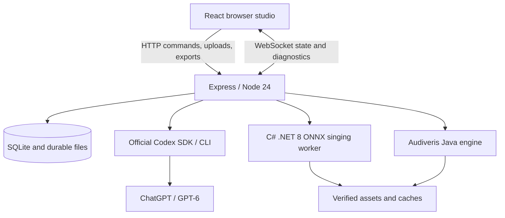

# Choirloom · 織聲


**One melody. Many voices.**

Choirloom is a browser-based vocal ensemble studio. Start with a lead melody, discover a song with lyrics, or ask AI to compose a new song. Choose the voices and styles, refine music through an ongoing conversation, rehearse with synthesized singing, and export complete scores or any combination of parts.

[Open the studio](https://test-officialwebsite.azurewebsites.net/Choirloom/)

## Table of contents

- [Features](#features)
- [Getting started in the studio](#getting-started-in-the-studio)
- [Language and interface](#language-and-interface)
- [Ensembles and musical approach](#ensembles-and-musical-approach)
- [Persistent AI chat](#persistent-ai-chat)
- [Prompt rewind, retry, and separate chats](#prompt-rewind-retry-and-separate-chats)
- [Reference files and mentions](#reference-files-and-mentions)
- [Free song score library](#free-song-score-library)
- [Importing scores](#importing-scores)
- [Playback, tempo, and exports](#playback-tempo-and-exports)
- [Voicebank manager](#voicebank-manager)
- [Publisher voice directory](#publisher-voice-directory)
- [Importing new voicebanks](#importing-new-voicebanks)
- [Native publisher voicebank adapter](#native-publisher-voicebank-adapter)
- [Adding and verifying publisher packages](#adding-and-verifying-publisher-packages)
- [Score workspace and saving](#score-workspace-and-saving)
- [Accounts, sharing, and administration](#accounts-sharing-and-administration)
- [WebSocket updates and diagnostics](#websocket-updates-and-diagnostics)
- [Architecture and hosting](#architecture-and-hosting)
- [Local development](#local-development)
- [Configuration](#configuration)
- [Azure deployment](#azure-deployment)
- [Storage and backups](#storage-and-backups)
- [Testing](#testing)
- [Troubleshooting](#troubleshooting)
- [Limitations](#limitations)
- [Repository layout](#repository-layout)
- [Third-party components and licensing](#third-party-components-and-licensing)

## Features

- Editable, versioned vocal scores with one to 24 independent parts.
- Individually selected voice types, ranges, synthesis voices, levels, and wordless syllables.
- Multiple ensemble styles and textures selected together.
- GPT-6 composition, arrangement, and revision through the official Codex SDK and CLI.
- Persistent chats, reference files, preferences, revisions, and job status.
- English and Traditional Chinese, with initial locale selected from the browser.
- A searchable library of lyric-bearing song scores with direct vocal-part import.
- Audiveris PDF/image recognition and structured MusicXML/MXL/MIDI imports.
- Instant vowel preview and DiffSinger singing with lyrics.
- Selective score and audio exports, combined or as individual parts.
- A browsable voice catalog with downloads, progress, cancellation, and removal.
- WebSocket updates and automatic reconnection, with admin-visible diagnostics.

## Getting started in the studio

1. Create an account with a name, email address, and password of at least 12 characters. Email verification is currently disabled.
2. Create a work, use the example, import a melody, or choose **Find scores** to browse the song library.
3. Set the part count, voice types, ranges, styles, and textures. Select the leading part when arranging an existing melody.
4. Choose a creative mode: **Arrange ensemble**, **Create a melody / song**, or **Revise melody, lyrics & arrangement**.
5. Describe the result, optionally attach references, select reasoning effort, and submit. Empty projects can be populated by the song-creation mode.
6. Review the result, edit notes/lyrics, adjust BPM, and continue refining through prompts. Locked notes remain protected.
7. Preview immediately, or download and assign a voicebank and render singing.
8. Export selected voices, or share a fixed score revision with a revocable link.

Settings is available through the upper-right gear. Administrators also see **Admin** there. The voice library is available from the sidebar and ensemble controls.

## Language and interface

On a first visit, the browser’s **primary language** determines the locale: Chinese tags select Traditional Chinese; English and unsupported languages select English. A saved user choice takes precedence. Account preferences persist across sessions and devices. Resetting preferences restores the browser-based language choice.

Interface text is at least **12 CSS pixels**, including captions, timestamps, and diagnostic rows. The interface includes labeled controls, keyboard-focus indicators, responsive layouts, and reduced-motion styling. Reference autocomplete supports arrows, Enter, Tab, and Escape. Ctrl/Cmd+Enter sends a chat message when autocomplete is closed.

## Ensembles and musical approach

Voice types include soprano, mezzo-soprano, alto, contralto, countertenor, tenor, baritone, bass, treble, and custom ranges. Voice type describes the musical part; the voicebank controls the actual synthesized timbre.

Styles include classical choral, Renaissance, Baroque, Romantic, contemporary choir, hymn/chorale, gospel, spiritual, barbershop, vocal jazz, swing, contemporary a cappella, pop, rock, R&B/soul, folk/traditional, musical theatre, cinematic, chant, and minimalist/ambient.

Textures include block harmony, close harmony, open voicing, counterpoint, canon, call and response, antiphonal writing, drone, lead and backing, and unison-to-harmony development.

GPT-6 is instructed to consider tonal/modal harmony, functional cadences, counterpoint, smooth voice leading, controlled dissonance, vocal tessitura, breathing, and lyric stress. Style matters: strict chorale writing differs from jazz extensions or intentional parallelism.

Arrangement mode preserves the lead melody and part IDs. Creation mode can write a new melody and original lyrics from an empty score. Revision and chat prompts can request changes to melody, lyrics, rhythm, tempo, or instrumentation. All modes protect locked notes.

Deterministic checks validate score structure, identifiers, overlap, ties, locked notes, and lead preservation where required. Range and leap findings are suggestions. These checks do not establish artistic quality or prove every music-theory rule; review generated music before performance.

### Bar ranges and score views

Choose **Composer view** for all voices or an individual voice from the score-view selector. The selection changes notation only; mixer controls determine which voices play. The view choice persists with the project.

Enable **Select bars**, then click, drag, or Shift-click bars to choose an inclusive range. Numeric first/last-bar fields provide keyboard control. The composer shows the active range. In an individual-voice view, the range also targets that voice. The server rejects changes to notes outside the range, notes crossing a boundary, untargeted parts, and global score metadata. Clear the range to resume whole-work edits.

During either playback mode, active noteheads and lyric syllables are highlighted. **Follow playback** scrolls the score automatically and can be disabled. Score text keeps a 12px minimum by allowing horizontal scrolling instead of shrinking notation to illegibility.

## Persistent AI chat

Submitted AI work runs on the server independently of the browser connection. Disconnecting, refreshing, or closing the page does not cancel it. Reopening a work restores saved messages, references, the current score, and the current/final job stage. Reconnection receives a fresh snapshot, including results completed while away.

Each user/project pair has a persistent Codex conversation ID. New prompts resume that conversation and include the authoritative score. Idempotency IDs prevent duplicate jobs when an uncertain submission is retried. Unsent drafts are cached locally and saved with the project view.

Completed assistant replies link to their resulting score revision. **Review** opens it; **Continue from this revision** creates a new current revision while preserving history. The history dialog also supports review and restoration. Selecting a work resumes its conversation.

Codex connection-retry warnings are recorded without prematurely aborting a recoverable turn. Terminal errors remain visible and have a retry action. A server process restart marks interrupted jobs explicitly; automatic browser reconnection does not imply transparent recovery of a terminated native process.

### Shared ChatGPT authentication

Only administrators connect or disconnect the shared ChatGPT service using Codex device authentication in Settings. That service supplies AI for registered users. Ordinary users can see readiness but cannot retrieve login codes or OAuth credentials.

The model is **`gpt-6-astra`**, with low, medium, high, xhigh, max, and ultra reasoning choices. There is no silent model fallback. Codex CLI is invoked by the official SDK and manages authentication and conversation state. Shell/editing tools are disabled; references are supplied explicitly as text and image inputs.

The connected account needs model access and sufficient usage allowance. See the [official Codex authentication documentation](https://learn.chatgpt.com/docs/auth).

## Reference files and mentions

Use the chat’s paperclip button or drag files onto the composer. These uploads help the prompt; they do not replace the score. Score import is a separate action.

| Reference | Extensions | Supplied to AI as |
| --- | --- | --- |
| PDF | `.pdf` | Extracted text and rendered page images |
| Images | `.png`, `.jpg`, `.jpeg`, `.webp` | Normalized images |
| Text | `.txt`, `.md`, `.csv`, `.json` | Text content |
| Structured score | `.xml`, `.musicxml`, `.mxl` | XML, decompressed for MXL |

Select files in the reference library or type **`@`** and choose autocomplete. Mentions use stable names such as `@style_notes.txt`; duplicates receive distinct suffixes. Attached references appear as removable chips. Historical messages retain links to their original uploads.

Limits: 12 MB per upload, 12 pages per PDF, 12 references per prompt, 20 reference images per AI request, and 250 MB of original uploads per account. Text inputs have additional size limits. PDF preparation is serialized to protect the host; derived page images consume extra space beyond original-file quota.

Files are scoped to the uploading user/project. Administrators can review them with the work; public score links do not include them. Reference content is untrusted and cannot enable tools or grant permissions.
## Free song score library

**Find scores** opens the OpenScore Lieder catalog. The checked-in index contains 1,462 completed editions with downloadable MusicXML, pinned to an upstream revision. Search titles, composers, lyricists, or collections; filter by language/composer and sort by title or composer. Browsing is paginated and filters persist per account.

Preview a song, choose a source part, and import it as a **new work**. Lyric-bearing vocal parts are offered first. Wordless vocalises and instrumental preludes/interludes also support import. Simultaneous notes become separate monophonic parts; duplicate rests are merged and unmatched ties are repaired with a review notice. For unusually fragmented instrumental notation, non-overlapping lines are packed into the studio’s part limit without dropping sounding notes. The original-source link and CC0 edition attribution are retained. Review the imported notation before arranging.

Sources: [OpenScore Lieder](https://github.com/OpenScore/Lieder) and its [official browsing index](https://fourscoreandmore.org/openscore/lieder/). The transcription editions are CC0; underlying composition and lyric rights can depend on jurisdiction. This catalog is primarily art songs, not a licensed catalog of current commercial pop songs.

Refresh the pinned index with `python scripts/refresh-score-library.py`. Scores are downloaded on demand from approved GitHub paths and checked against their pinned Git blob hashes. Arbitrary client-supplied download URLs are not accepted. All **1,462 entries and 1,699 source-part imports** passed the September 8, 2026 audit; see [the verification record](config/score-library-verification.json). Run `npx tsx scripts/verify-score-library.ts` to recheck the catalog and its source hashes. The audit uses an ignored local cache under `.runtime/score-audit`.

## Importing scores

MusicXML (`.xml`, `.musicxml`), compressed MusicXML (`.mxl`), and MIDI (`.mid`, `.midi`) can be imported directly. PDF, PNG, JPEG, TIFF, and SVG score imports use **Audiveris 5.11** recognition. Optical results open for review before acceptance.

The score model uses monophonic parts and 480 ticks per quarter note. MusicXML chord tones and concurrent voices are automatically split into independent parts. Optical recognition may misread notes or lyrics; correct them in the editor. SVG input is rasterized on a white background, at up to 5,600 pixels on the longer edge and 20 megapixels (the recognition engine limit), before recognition. It must be self-contained: external image/font references and active content are rejected. SVG is a visual format, so notes and lyrics still require optical recognition and review.

## Playback, tempo, and exports

**Instant preview** uses browser vowel synthesis without lyric pronunciation or a downloaded voicebank. **Rendered singing** runs DiffSinger inference through the C# ONNX worker and produces individual WAV/MP3 stems and a mixed rendering. Playback supports part levels, mute, solo, and looping.

BPM is adjustable in the bar above playback with a number field, plus/minus buttons, slider, and **Tap** control. Changes persist in the score. Existing tempo-map changes scale proportionally; rendered singing must be regenerated after a tempo change.

Wordless choices are sustained **ah**, sustained **woooo**, **ba-ba-bom**, **da-da-dum**, and **scat**. Authored lyrics take precedence. Unknown pronunciations may require corrected syllables or explicit phonemes, such as `[en/b en/aa]`.

| Export | Combined selection | Separate parts |
| --- | --- | --- |
| PDF, SVG, PNG | Engraved selected voices | Individual engraved parts |
| MusicXML, MXL, MIDI, JSON | Structured selected score | One score per voice |
| WAV, MP3 | Mix of selected rendered stems | Unmixed individual stems |

Multiple separate files download as a ZIP. Audio mixing uses selected part levels and peak protection. Export selection is independent of playback mute/solo and persists per user/project. Audio exports reuse a matching completed render without resynthesizing each combination.

## Voicebank manager

The entire configured catalog appears by default, including installed voices. Search names, aliases, languages, or ranges; filter by language and download state. Empty results offer a clear-filters action. A broken catalog is shown as an error rather than an endless preparation message.

The catalog includes independently configured singers and model variants. Each card lists the lyric handling verified in Choirloom. Select a singer separately for each part: changing the musical voice type adjusts its range but does not change the singer’s identity. Qixuan also supports Mandarin characters/pinyin and Japanese kana/romaji.

Downloads are shared by all users: one installed copy serves the entire studio. Any user can download a voice; only administrators can cancel or remove shared downloads. Progress and storage are shared. Removing a download preserves projects, assignments, and rendered audio. Removal is blocked during any active render. Interrupted downloads can be retried.

`config/voicebanks.json` defines approved URLs, SHA-256 hashes, model paths, aliases, languages, and licensing links. Workers verify assets and reject unsafe archive paths. Workers can fetch checksum-pinned original packages from the configured Azure asset path, GitHub releases, public Google Drive downloads, and the approved NeuroSynth model endpoint. Downloaded weights remain in the private shared cache.

## Accounts, sharing, and administration

Normalized email uniquely identifies an account; display names need not be unique. Passwords use Argon2. HTTP-only session cookies, expiry, CSRF/origin checks, and rate limits protect API actions. Email verification is intentionally disabled; password recovery needs SMTP in production.

Owners can grant viewer/editor access to accounts or create expiring, revocable links pinned to a score revision. Downloads can be enabled or disabled. Public score links do not expose private chats or reference files.

Administrators can manage shared ChatGPT authentication, promote/demote existing users, browse all users and works, and inspect diagnostics. At least one administrator must remain. Admin status grants read access to another owner’s work, not automatic editing or ownership. Server-side checks apply to both HTTP and live connections.

Bootstrap the first admin after signup with `deploy/Set-Admin.ps1 -Email <account-email>` for the configured Azure installation. It backs up the database before updating the role. Later changes can use the Admin console. Signup fields and preferences cannot grant admin status.

## WebSocket updates and diagnostics

Authenticated clients connect to **`/Choirloom/api/live`**, subscribing with the session CSRF token. Mutations push project, chat, job, voicebank, AI-connection, and admin updates. Automatic reconnection receives authoritative snapshots. Business-state updates do not use HTTP/SSE polling.

Ping/pong heartbeats detect dead sockets. Playback animation, autosave debouncing, and failed-log-delivery retry timers are local mechanisms, not server-state polling. Commands, uploads, exports, and explicit historical reads still use HTTP.

The upper-right connection badge shows live/reconnecting/offline status and can reconnect manually. Submitted jobs continue when the browser connection is unavailable.

### Diagnostics

Server logs cover request IDs/duration, queue stages, native process output/exit, AI events/retries, references, voice downloads, catalog imports, and role changes. Browser logs capture JavaScript errors, rejected promises, console warnings/errors, API failures, and connection transitions.

Browser records are redacted before entering a bounded local buffer. They upload at the next opportunity over WebSocket, with HTTP fallback and a page-close beacon. Acknowledgments and event IDs prevent duplicate storage. Delivery is best effort if connectivity or storage is unavailable.

**Admin → Live diagnostics** filters records by severity, source, search, and job ID, with manual loading of older entries. Client-reported entries are labeled separately from server records. Passwords, OAuth/session/CSRF secrets, prompt/score bodies, and known share-token patterns are redacted. Do not deliberately place secrets in free-form diagnostic text.

Diagnostic retention is approximately 20,000 entries or 14 days, with periodic cleanup. Chat histories and score revisions are stored separately and are not removed by diagnostic retention.
## Architecture and hosting



The current deployment uses an **existing Windows Azure App Service** at `/Choirloom/`, without a new App Service or plan upgrade.

| Component | Current location |
| --- | --- |
| React, Express, WebSocket server | Azure isolated IISNode virtual application |
| SQLite, accounts, projects, chats, references | Azure durable data directory |
| Codex SDK/CLI and shared OAuth state | Azure |
| DiffSinger inference | Azure C# ONNX worker |
| Audiveris recognition | Azure original Java engine and headless bootstrap |
| Voice/engine distributions and caches | Azure asset tier and shared voice caches |
| OCI | No Choirloom service currently installed; optional future worker placement |

IIS assigns a named pipe to Node. A single Node process and sequential heavy-job queue suit the existing host. Other virtual applications remain separate. `deploy/AzureHost` is an obsolete prototype, **not** the production entry point.

## Local development

Requirements: Node 24+, npm, .NET SDK 8 for singing, and a JDK 21+ to build the Audiveris bootstrap. The provided native packaging targets Windows x64. Azure helpers also require authenticated Azure CLI and Python 3. Actual AI requests require access to the configured model.

Independently managed CLI tools in this workspace are installed under `C:\Tools`, with executable directories on the user PATH. The pinned Codex SDK also depends on its CLI package.

```powershell
npm ci
Copy-Item .env.example .env
npm run server
# In another terminal:
npm run dev
```

Open **http://127.0.0.1:5173/Choirloom/**. Match `APP_ORIGIN` exactly: `localhost` and `127.0.0.1` are different origins.

Set `CODEX_BIN` to a native Codex executable, or remove the override to let the SDK use its bundled CLI. Build workers with:

```powershell
./deploy/Build-Workers.ps1 -JavaHome C:\Tools\your-jdk
```

Point `DIFFSINGER_COMMAND` and `AUDIVERIS_BIN` to `.runtime\singer\Singer.exe`. Configure manifests and obtain licensed assets separately. The UI, structured score editing, and instant preview can be developed without AI or voice downloads.

## Configuration

Copy `.env.example`; never commit `.env` or credentials.

| Variable | Purpose |
| --- | --- |
| `PORT`, `HOST` | Local listener; IIS provides a named-pipe `PORT` |
| `APP_ORIGIN` | Exact browser origin for request/WebSocket checks |
| `APP_BASE` | Virtual prefix, normally `/Choirloom` |
| `DATA_DIR` | Durable database, files, and account data |
| `NODE_ENV` | Production enables secure cookies |
| `CODEX_BIN` | Optional native Codex executable override |
| `DIFFSINGER_COMMAND`, `AUDIVERIS_BIN` | Published C# worker executable |
| `VOICEBANK_MANIFEST` | Voice manifest; defaults to `config/voicebanks.json` |
| `AUDIVERIS_MANIFEST` | Audiveris asset manifest |
| `SCORE_LIBRARY_MANIFEST` | Song catalog; defaults to `config/score-library.json` |
| `CHOIRLOOM_ASSET_SOURCE` | Colocated original asset directory |
| `ENGINE_CACHE` | Fast extraction cache, defaulting to temporary storage |
| `SMTP_HOST`, `SMTP_PORT`, `SMTP_USER`, `SMTP_PASS`, `MAIL_FROM` | Optional recovery email configuration |
| `SSL_CERT_FILE`, `CODEX_CA_CERTIFICATE` | Optional operator-managed trust files passed to Codex |

The Azure entry script sets production paths. Helpers/manifests currently target the existing installation; adapt their names and URLs before deploying a separate instance. Do not bypass certificate verification to mask network errors.

## Azure deployment

Production uses **`deploy/iisnode/entry.cjs` and `deploy/iisnode/web.config`**. The existing Windows App Service must support IISNode and enable WebSockets. The scoped app config disables IIS’s native WebSocket module so IISNode handles upgrades.

```powershell
./deploy/Build-Azure.ps1
./deploy/Deploy-Azure.ps1 -SkipAssets
```

The build stages compiled UI/server code, the worker, Node runtime, and production dependencies under `.runtime/azure`. `-SkipWorkers` and `-SkipDependencies` reuse prepared components and should be used only when those components have not changed.

The deploy helper uploads that staging tree and, if necessary, appends the isolated virtual application without replacing others. Publishing credentials stay in process memory; Python/OpenSSL handles transfer compatibility on this host.

- `-CodeOnly -SkipAssets` updates code/configuration with a brief maintenance page; it does not update npm dependencies.
- A normal application deployment also updates dependencies and runtime.
- `-AssetsOnly` uploads assets without replacing code.
- `-AssetsOnly -AssetName <filename>` publishes one staged asset.
- `-AssetsDirectory <directory>` on the build script stages separately obtained distributions.

Match manifests, filenames, model paths, and hashes to the actual assets. Never upload the workspace wholesale. Inspect active jobs and back up durable data before maintenance. Restarting Node interrupts native jobs, which become explicitly retryable on startup.

## Storage and backups

Current Azure paths:

- Application: `%HOME%\site\choirloom-app`.
- Durable data: `%HOME%\data\choirloom`.
- Extracted engine cache: temporary worker storage, normally `C:\local\Temp\choirloom-engines`.

Durable data includes SQLite, original references and derived images, rendered outputs, downloaded voices, workspaces, and Codex state. OAuth credentials live under `codex/service` and are never served to the browser. Passwords are hashed; uploaded files and OAuth state are not encrypted by application code, so restrict data/backup access.

Use a consistent SQLite backup operation or stop writers before copying SQLite and WAL state. Back up associated durable files, not just the database. Temporary engine caches can be regenerated from verified assets.

## Testing

```powershell
npm run check
npm test
npm run build
npm run build:server
```

Tests cover identity/access, CSRF, shared AI administration, roles and last-admin protection, WebSocket snapshots/reconnection, queue transitions, diagnostic redaction/deduplication, PDF/image/text references, idempotent chat, locale selection, score validation, and selective exports.

The native audio test runs after the worker is built; otherwise it is skipped. Tests use temporary data directories and do not connect to real ChatGPT accounts. Deployment validation must additionally check Azure routing, model availability, native workers, and actual assets.

## Troubleshooting

| Symptom | What to inspect |
| --- | --- |
| Work appears queued | Reconnect and inspect its persisted stage. Diagnostics distinguish queued, started, and terminal events. |
| AI reconnects repeatedly | Check `ai.connection.retry` and `ai.turn.failed`. Intermediate warnings may recover. |
| AI unavailable | An admin must connect ChatGPT. Check account allowance and model access. |
| No matching voices | Clear filters. Available-to-download excludes installed voices. Clear publisher and compatibility filters too. |
| Voice catalog error | Check manifest location/validity and `voice.catalog.failed`. |
| No singing output | Download and assign a voice to each sounding part, then inspect worker output/exit. |
| Unknown lyric syllable | Correct syllabification or supply supported explicit phonemes. |
| Reference upload fails | Check format, size/page limits, and whether another reference is preparing. |
| Library song cannot import | Some notation needs external correction or voice splitting; the source link provides the original. |
| WebSocket upgrade fails | Check exact origin, HTTPS/session, App Service WebSockets, and scoped IISNode config. |
| Password recovery unavailable | Configure SMTP; signup verification remains disabled. |
| Score revision conflict | Preserve the local draft and compare against the newer server revision. |

Use job/request IDs to correlate browser and server records in the Admin console. Final failures remain visible after reconnection.

## Limitations

- AI musical quality varies; validation is not a full music-theory proof system.
- The model supports monophonic parts and one meter/key, not every notation feature. OCR and library imports need review.
- Publisher models vary in range, timbre, language coverage, and licensing. Some catalog entries are variants of the same singer.
- CPU singing/OMR can be slow. Heavy jobs are sequential, with one queued/running job per user and a 20-minute timeout.
- Browser closure is supported; native jobs interrupted by a host restart require retry.
- Diagnostic delivery is best effort and bounded; durable chat/revision history is separate.
- SQLite and the in-process event bus assume one app process. Horizontal scaling requires shared queue/event coordination.
- Reference uploads do not accept audio/video or office document formats.
- Voice and engine assets are distributed separately from Git source.

## Repository layout

```text
src/                        React studio, playback, chat, library, admin UI
server/                     API, jobs, OAuth, references, live state, diagnostics
shared/                     Score schema/conversion, selection, locale, redaction
workers/Singer/             C# ONNX singing, assets, audio export, OMR launcher
workers/AudiverisBootstrap/  Java headless bootstrap
config/                     Voice, engine, and song-library manifests
scripts/                    Catalog maintenance
public/brand/               Choirloom vector identity
public/notices.html         In-app third-party notices
tests/                      Regression tests
deploy/iisnode/              Production Azure entry point
deploy/                     Build, transfer, inspection, admin bootstrap
IMPLEMENTATION_PLAN.md      Current decisions and boundaries
```

## Third-party components and licensing

The Codex SDK/CLI, React, Verovio, ONNX Runtime, PDF.js, native canvas, and other dependencies retain their licenses. See package metadata and [in-app notices](public/notices.html).

[Audiveris 5.11.0](https://github.com/Audiveris/audiveris/tree/5.11.0) is distributed separately under AGPL-3.0. Its original Java engine is retained; source and license obligations remain applicable.

[Qixuan’s terms](https://github.com/yqzhishen/qixuan-diffsinger/blob/main/terms_of_use/Terms_of_Use.zh-CN.md) include attribution, synthesized-output identification, and cloud/free-service conditions. Retain the original distribution’s terms and artwork. Public availability does not imply unrestricted redistribution or commercialization.

[OpenScore Lieder](https://github.com/OpenScore/Lieder) supplies CC0 transcriptions and metadata. Choirloom preserves source attribution; the source repository includes the complete CC0 dedication.

Credentials, user data, runtime bundles, model weights, voice distributions, and generated deployment artifacts are excluded from Git. Check original asset terms before redistribution.

### Prompt rewind, retry, and separate chats

Each project's arranger has a **Chat history** selector and **New chat** button. New chats keep the current score and retain older conversations for review and continuation. Each chat has separate AI context and a saved draft.

User prompts have **Rewind to prompt** and **Retry** controls. Rewind removes the selected prompt and all later turns in that chat, restores its starting score as a new project revision, and returns its text, references, reasoning level, mode, and bar selection to the composer. Retry performs the same rewind and queues that prompt again. Earlier score revisions remain in version history. Finish or cancel active jobs before switching or rewinding. These actions apply only to your own prompts in projects you can edit.

### Publisher voice directory

The directory contains 17 voicebank entries, including Printto variants: Qixuan, Umidaji, Nishiren Gard, NeuroSynth, Printto V5, Tanya, Kaiz, FranceFrank, Petchploy, Printto Pure, Printto Millefeuille, Ada Synphonia, Leif, TIGER, Canary, LIEE and Ria. Browse without a keyword or filter by language, publisher, compatibility and download status.

All 14 additions passed actual native singing smoke tests. **All 17 entries are enabled.** On September 8, 2026, the site operator confirmed creator permission covering LIEE in Choirloom; its card retains the publisher terms and attribution. See [the verification record](config/voice-verification.json) for pinned hashes and results. The other additions use verified English/wordless pronunciation paths; Ria uses Chinese, Japanese and wordless paths. NeuroSynth also passed Japanese pronunciation and every Choirloom wordless pattern through the live admin importer, including a page reload during verification. These labels describe tested Choirloom capabilities, not every language in the publisher's training data.

Installed voices are shared by all users. Original archives and notices remain in the private Azure cache, and are not republished as public downloads. Publisher terms apply, including restrictions that vary by voice. This maintained directory is not an exhaustive index of every voice on the internet. Admins can import further compatible ONNX packages through the UI. Refresh publisher metadata with `python scripts/refresh-voice-directory.py` and review changed sources before deployment.

Browser diagnostics buffer startup events until session initialization finishes. If an HTTP upload encounters a rotated session token, the client refreshes its token before retrying; origin and CSRF enforcement remain enabled.

### Score workspace and saving

Choose **Configure part** in the Ensemble panel to edit any part’s name, voice type, range, singer, wordless syllables, and lead assignment. This selection is saved with the project view. The part controls scroll independently.

The score has a dedicated scrollable viewport and a page selector. **Full-screen score** fills the application viewport with notation; use **Exit full screen** or Escape to return. The normal layout prioritizes notation and keeps the voice mixer collapsed until opened. Playback following and bar selection work in both views.

Score requests time out after 30 seconds instead of showing Saving indefinitely. Failed saves expose **Retry save**. Local draft backup failures are logged and do not prevent server saving; a failed save retains the current in-memory draft. Browser storage may be unavailable or full, so a local backup cannot always be guaranteed.

### Native publisher voicebank adapter

The .NET singer reads OpenUtau `dsconfig.yaml`, JSON or text phoneme inventories, language IDs, speaker embeddings, and embedded vocoder configuration without rewriting model weights or publisher files. It supports the renderer’s continuous and legacy acceleration inputs and converts mel logarithm bases when required. Unsupported model inputs or incompatible vocoder settings fail installation validation.

Umidaji v110 has been tested with English lyrics and wordless syllables using its first speaker style, `umidaji-snow`. It downloads the original checksum-pinned GitHub release directly into the private shared Azure cache; the application does not republish the package as a public asset. Team BRAPA restricts use to personal, noncommercial purposes without additional permission, requires attribution, and imposes other conditions: consult the included terms and publisher link. This adapter does not yet reproduce OpenUtau’s full pronunciation, variance, pitch-prediction, or style-mixing pipeline. Each newly enabled entry has a pinned package and an actual inference record. The site operator confirmed the required creator permission for LIEE in Choirloom.

Nishiren Gard v2.0 also passed English/wordless WAV and MP3 inference on Azure, using its Standard speaker embedding and bundled vocoder. Its original archive remains intact in the private cache. Attribution is required, commercial use needs author approval, and the publisher’s additional terms apply.


### Adding and verifying publisher packages

Native OpenUtau packages use `dsConfig` to locate their original acoustic configuration. `innerArchive` selects a nested voice ZIP when a publisher ships a larger package. Embedded `dsvocoder/vocoder.yaml` settings are read directly. A separately distributed vocoder uses `vocoderBundle`, `vocoder`, and (when no vocoder YAML is included) `vocoderMelBase`. Text and JSON phoneme inventories are supported, as are speaker embeddings and continuous/legacy acceleration inputs. Nested packages use short cache paths to avoid Windows native path limits.

Before enabling a catalog entry, pin the original archive’s SHA-256, inspect its configuration and terms, validate native model inputs, and render actual lyrics and wordless notes to WAV/MP3. Keep a small verification record. Verification uses an isolated temporary workspace, one voice at a time; remove the package, extracted models, and test audio before starting the next voice. This cleanup does not remove shared installations.

### Importing new voicebanks

An administrator can open **Shared voice library → Import a new voice from a URL**. Supply a name, publisher attribution, a public ZIP download URL (Google Drive share links are also accepted), and the publisher's license URL. An optional configuration path selects a particular model in a package; an optional ONNX vocoder ZIP supplies a dependency that is not in the built-in vocoder registry.

The importer downloads one package at a time, pins its SHA-256, inspects OpenUtau DiffSinger configurations and nested ZIPs, detects JSON or text phoneme inventories and speaker embeddings, and resolves embedded or registered vocoders. The current native engine requires 44.1 kHz audio, 512-sample hops and 128 mel bins. Original model weights and publisher notices are preserved. PyTorch training checkpoints and traditional UTAU sample banks require a different conversion or rendering engine and are rejected with a diagnosis.

Before publishing a voice, Choirloom validates its ONNX inputs and renders the supported wordless syllables plus sample lyrics for detected English, Chinese and Japanese pronunciation paths. It checks actual PCM samples for non-silent output and verifies MP3 output. This is an inference smoke test, not a guarantee of pronunciation quality for every lyric or parity with every OpenUtau feature. The first speaker style is used; unsupported configurations and vocoders are reported explicitly.

Progress and errors are stored in SQLite and pushed over WebSocket. Reopening the page restores the import history, configuration choices and retry form. An application restart marks unfinished imports as interrupted so an admin can retry them. Completed imports join the durable catalog and shared installation, so all users can select them and later reinstall them after removal. Only admins can import or remove shared voices.

Temporary archives, extracted duplicates and test audio are removed before another import begins. Verified shared installations remain available while storage permits. Downloads and extraction have size limits and space checks; public HTTPS destinations and each redirect are validated, and private network addresses are rejected. Import manifests live in the database and are merged into the effective worker manifest, so deployments do not erase them.
